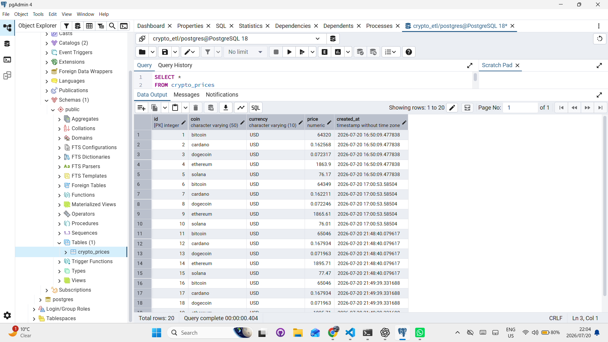
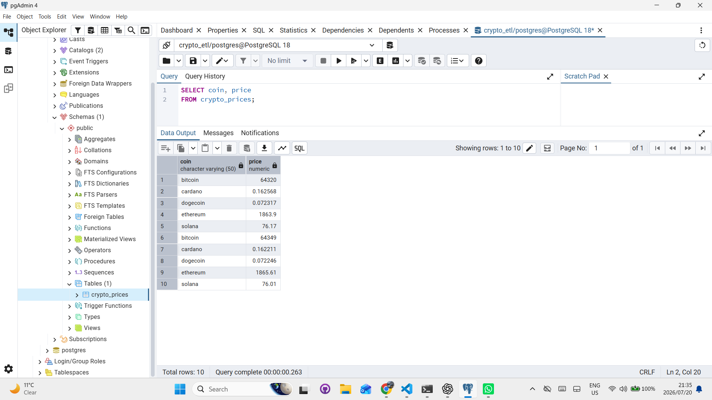
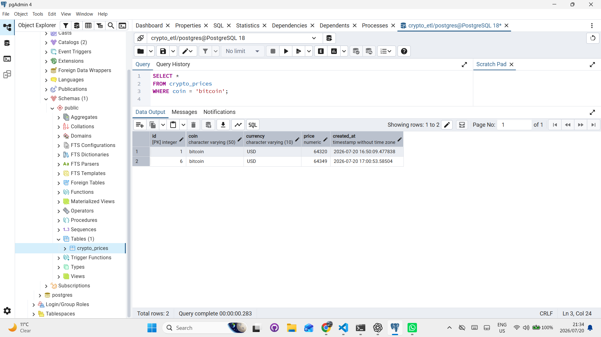
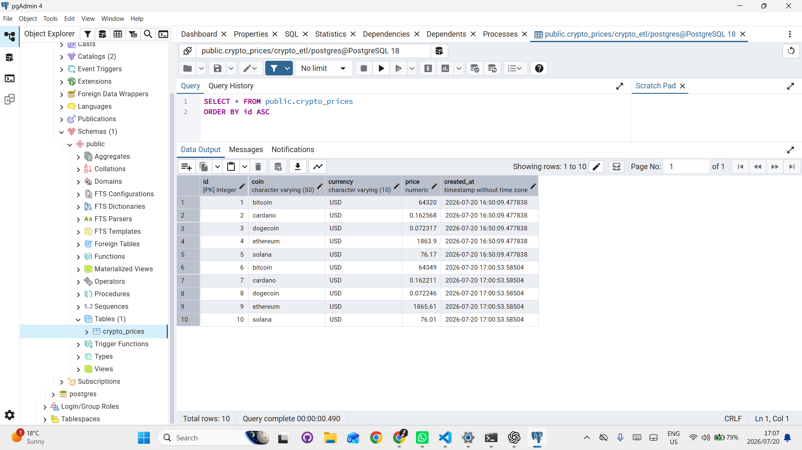
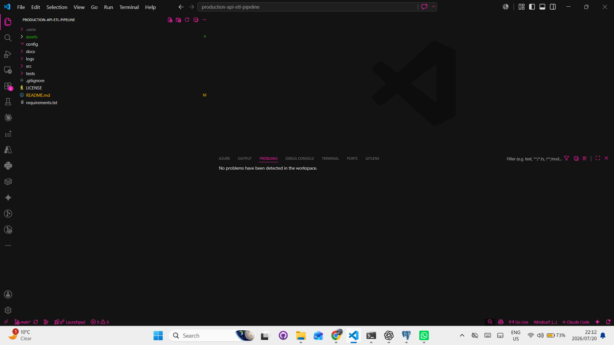

# 🚀 Production API ETL Pipeline

A production-style ETL (Extract, Transform, Load) pipeline built with **Python** and **PostgreSQL** that retrieves live cryptocurrency market data from the CoinGecko API, transforms it into a structured format, and stores historical snapshots in a relational database for SQL analysis.

---

## 📖 Overview

This project demonstrates a complete data engineering workflow.

The pipeline:

- Extracts live cryptocurrency prices from the CoinGecko REST API
- Transforms nested JSON into clean Python records
- Loads data into PostgreSQL using parameterized SQL queries
- Stores historical price snapshots for future analytics
- Allows querying using SQL inside pgAdmin or psql

This project was built to practice real-world Data Engineering concepts including ETL pipelines, relational databases, SQL, API integration, logging, Git workflows, and modular software design.

---

# 🏗️ Architecture

```
                    CoinGecko API
                          │
                          ▼
                 Extract (extract.py)
                          │
                          ▼
                    Raw JSON Response
                          │
                          ▼
              Transform (transform.py)
                          │
                          ▼
               Clean Python Dictionaries
                          │
                          ▼
                 Load (load.py + SQL)
                          │
                          ▼
                   PostgreSQL Database
                          │
                          ▼
                   SQL Analytics Layer
```

---

# 📂 Project Structure

```
production-api-etl-pipeline/

│
├── assets/
│   ├── pipeline-run.png
│   ├── pgadmin-table.png
│   ├── project-structure.png
│   ├── sql-query.png
│   ├── sql-query-where.png
│   └── sql-query-ordered-asc.png
│
├── config/
│
├── docs/
│
├── logs/
│   └── pipeline.log
│
├── src/
│   ├── __init__.py
│   ├── extract.py
│   ├── transform.py
│   ├── load.py
│   └── pipeline.py
│
├── tests/
│
├── requirements.txt
├── LICENSE
├── README.md
└── .gitignore
```

---

# 🚀 ETL Workflow

## 1️⃣ Extract

Retrieve live cryptocurrency prices from the CoinGecko REST API.

Example response:

```json
{
    "bitcoin": {
        "usd": 65046
    }
}
```

---

## 2️⃣ Transform

Convert nested JSON into clean Python dictionaries.

Example:

```python
{
    "coin": "bitcoin",
    "currency": "USD",
    "price": 65046
}
```

---

## 3️⃣ Load

Insert transformed records into PostgreSQL using parameterized SQL.

```python
cursor.execute(
    """
    INSERT INTO crypto_prices
    (coin, currency, price)
    VALUES (%s, %s, %s)
    """,
    (
        record["coin"],
        record["currency"],
        record["price"]
    )
)
```

---

# 🗄 PostgreSQL Database Schema

```sql
CREATE TABLE crypto_prices (

    id SERIAL PRIMARY KEY,

    coin VARCHAR(50),

    currency VARCHAR(10),

    price NUMERIC,

    created_at TIMESTAMP DEFAULT CURRENT_TIMESTAMP

);
```

---

# 📸 Project Demonstration

## ▶️ ETL Pipeline Execution

The complete ETL pipeline running successfully.


---

## 🗄 PostgreSQL Table

Historical cryptocurrency data stored inside PostgreSQL.



---

## 🔍 SQL Query

Retrieve every record.

```sql
SELECT *
FROM crypto_prices;
```



---

## 🔎 SQL WHERE Clause

Retrieve Bitcoin records only.

```sql
SELECT *
FROM crypto_prices
WHERE coin='bitcoin';
```



---

## 📈 ORDER BY

Sort results by ID.

```sql
SELECT *
FROM crypto_prices
ORDER BY id ASC;
```



---

## 📁 Project Structure

Visual overview of the project.



---

# 🛠 Technologies Used

- Python 3.13
- PostgreSQL 18
- SQL
- pgAdmin 4
- psycopg2
- Requests
- Git
- GitHub
- VS Code

---

# 📦 Installation

Clone the repository.

```bash
git clone https://github.com/Boitybanks/production-api-etl-pipeline.git
```

Navigate into the project.

```bash
cd production-api-etl-pipeline
```

Create a virtual environment.

```bash
python -m venv .venv
```

Activate the environment.

### Windows

```bash
.venv\Scripts\activate
```

Install dependencies.

```bash
pip install -r requirements.txt
```

---

# ▶️ Run the ETL Pipeline

```bash
python src/pipeline.py
```

Expected output:

```
Starting ETL Pipeline...

Extraction successful.

Load successful.

Clean Records:

{'coin': 'bitcoin', 'currency': 'USD', 'price': 65046}
...
```

---

# 🧠 SQL Examples

Retrieve all records.

```sql
SELECT *
FROM crypto_prices;
```

Retrieve specific columns.

```sql
SELECT coin,
       price
FROM crypto_prices;
```

Retrieve Bitcoin prices.

```sql
SELECT *
FROM crypto_prices
WHERE coin='bitcoin';
```

Sort results.

```sql
SELECT *
FROM crypto_prices
ORDER BY id ASC;
```

Count records.

```sql
SELECT COUNT(*)
FROM crypto_prices;
```

Retrieve latest prices.

```sql
SELECT *
FROM crypto_prices
ORDER BY created_at DESC;
```

Retrieve highest Bitcoin price recorded.

```sql
SELECT MAX(price)
FROM crypto_prices
WHERE coin='bitcoin';
```

---

# 📊 Skills Demonstrated

This project demonstrates:

- ETL Pipeline Design
- REST API Integration
- Data Extraction
- JSON Transformation
- Relational Databases
- PostgreSQL
- SQL
- Parameterized SQL Queries
- Database Design
- Logging
- Git Version Control
- GitHub Workflow
- Modular Python Programming
- Data Engineering Fundamentals

---

# 🎯 What I Learned

While building this project I gained practical experience with:

- Building a modular ETL pipeline
- Consuming third-party APIs
- Understanding nested JSON structures
- Transforming raw data into structured records
- Creating PostgreSQL databases
- Designing relational tables
- Writing SQL queries
- Using parameterized SQL safely
- Loading data into PostgreSQL
- Querying databases using pgAdmin
- Git branching, commits and pushes
- Organizing production-style Python projects

---

# 🚀 Future Improvements

Planned enhancements include:

- Docker support
- Environment variables using `.env`
- Configuration management layer
- YAML configuration files
- Scheduling with Cron / Windows Task Scheduler
- Apache Airflow orchestration
- Unit and integration testing
- Data validation
- Logging improvements
- CI/CD with GitHub Actions
- AWS EC2 deployment
- AWS RDS PostgreSQL
- AWS S3 Data Lake
- Dashboard using Streamlit
- Historical price analytics
- Data visualization

---

# 📚 Concepts Covered

- ETL
- APIs
- JSON
- Python
- SQL
- PostgreSQL
- Database Design
- Parameterized Queries
- Logging
- Git
- GitHub
- Data Engineering

---

# 👨‍💻 Author

## Boitumelo Banks

Junior Software Engineer • Aspiring Data Engineer • Cloud Computing Student

GitHub:

https://github.com/Boitybanks

---

# ⭐ If you found this project interesting

Feel free to fork the repository, leave a star ⭐, or contribute improvements.